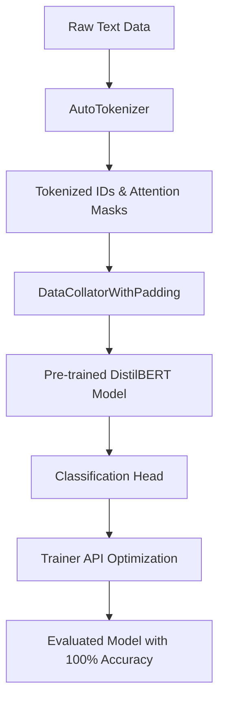

# 🎓 CHAPTER 4 - LAB 3: FINE-TUNE MODELS AND TRAINING ALGORITHMS
> **Bài thực hành:** Practice 3 - Get Started with Hugging Face  
> **Môn học:** Học Sâu (Deep Learning)  
> **Đơn vị:** Viện Công nghệ Thông tin, Điện, Điện tử - Trường Đại học Giao thông Vận tải TP.HCM (UT)  
> **Giảng viên hướng dẫn:** TS. Nguyễn Thị Khánh Tiên  

---


---

## 📋 MỤC LỤC
1. [Giới Thiệu Tổng Quan](#-giới-thiệu-tổng-quan)
2. [Cấu Trúc Thư Mục Dự Án](#-cấu-trúc-thư-mục-dự-án)
3. [Nội Dung Chi Tiết Các Bài Tập](#-nội-dung-chi-tiết-các-bài-tập)
   - [Exercise 1: Sentiment Analysis with Hugging Face](#exercise-1-sentiment-analysis-with-hugging-face)
   - [Exercise 2: Finetuning a Pretrained Model for Binary Text Classification](#exercise-2-finetuning-a-pretrained-model-for-binary-text-classification)
4. [Sơ Đồ Quy Trình Fine-Tuning](#-sơ-đồ-quy-trình-fine-tuning)
5. [Hướng Dẫn Cài Đặt & Thực Thi](#-hướng-dẫn-cài-đặt--thực-thi)
6. [Kết Quả Đánh Giá & Kiểm Thử](#-kết-quả-đánh-giá--kiểm-thử)

---

## 🎯 GIỚI THIỆU TỔNG QUAN

Bài thực hành nhằm mục đích giúp sinh viên nắm vững cách ứng dụng thư viện **Hugging Face (`transformers`, `datasets`, `evaluate`)** kết hợp với **PyTorch** để:
- Sử dụng trực tiếp các mô hình học sâu Pre-trained cho bài toán Xử lý Ngôn ngữ Tự nhiên (NLP).
- Nắm vững quy trình mã hóa dữ liệu (Tokenization) và tính toán chuyển đổi từ Logits sang xác suất.
- Thực hiệnFine-tuning mô hình ngôn ngữ lớn (như DistilBERT) cho bài toán phân loại văn bản nhị phân (Binary Text Classification) trên tập dữ liệu đánh giá cảm xúc.

---

## 📁 CẤU TRÚC THƯ MỤC DỰ ÁN

```text
d:\lab3 học sâu\
├── 📄 Chapter 4 - FINE-TUNE MODELS AND TRAINING ALGORITHMS.pdf   # Slide bài giảng gốc của giảng viên
├── 📓 Practice_3_HuggingFace.ipynb                                # File Jupyter Notebook làm bài chính (gồm cả 2 bài tập)
├── 📊 train_data.csv                                             # Tập dữ liệu huấn luyện nhị phân (500 mẫu)
├── 📊 test_data.csv                                              # Tập dữ liệu kiểm thử (100 mẫu)
├── 📁 results_practice3/                                         # Thư mục chứa Checkpoint mô hình sau khi Fine-tune
└── 📝 README.md                                                   # Tài liệu hướng dẫn & Báo cáo chi tiết
```

---

## 📚 NỘI DUNG CHI TIẾT CÁC BÀI TẬP

### Exercise 1: Sentiment Analysis with Hugging Face
- **Mục tiêu**: Sử dụng mô hình Pre-trained để phân tích cảm xúc của câu văn.
- **Mô hình sử dụng**: `distilbert-base-uncased-finetuned-sst-2-english`.
- **Phương pháp**:
  1. Tokenize văn bản đầu vào: Chuyển đổi ký tự thành `input_ids` và `attention_mask`.
  2. Chạy mô hình (Forward pass) để thu được các giá trị `logits`.
  3. Áp dụng hàm Softmax để chuyển Logits thành xác suất:
     $$\text{Softmax}(z_i) = \frac{e^{z_i}}{\sum_{j} e^{z_j}}$$
  4. Xác định nhãn có xác suất cao nhất (`POSITIVE` hoặc `NEGATIVE`).

---

### Exercise 2: Finetuning a Pretrained Model for Binary Text Classification
- **Mục tiêu**: Tinh chỉnh mô hình `distilbert-base-uncased` cho bài toán phân loại nhị phân dựa trên tập dữ liệu riêng.
- **Quy trình 7 bước**:
  1. Cài đặt các thư viện cần thiết.
  2. Nạp dữ liệu nhị phân (`train_data.csv` & `test_data.csv` hoặc IMDb từ Kaggle).
  3. Tải mô hình Pre-trained và Tokenizer với `num_labels=2`.
  4. Tiền xử lý dữ liệu với `tokenize_function` và `DataCollatorWithPadding`.
  5. Cấu hình tham số huấn luyện `TrainingArguments` (Learning Rate = 2e-5, Batch Size = 8, Epochs = 2).
  6. Khởi tạo đối tượng `Trainer` và tiến hành huấn luyện (`trainer.train()`).
  7. Đánh giá mô hình sau fine-tune bằng metric `accuracy` (`trainer.evaluate()`).

---

## 🔄 SƠ ĐỒ QUY TRÌNH FINE-TUNING



---

## 🛠️ HƯỚNG DẪN CÀI ĐẶT & THỰC THI

### Bước 1: Khởi tạo môi trường & Cài đặt thư viện
Mở Terminal / Command Prompt và chạy lệnh sau:
```bash
pip install transformers torch datasets evaluate accelerate pandas matplotlib seaborn
```

### Bước 2: Chạy file Jupyter Notebook
1. Mở VS Code, điều hướng tới thư mục `d:\lab3 học sâu`.
2. Mở file **`Practice_3_HuggingFace.ipynb`**.
3. Chọn Kernel Python phù hợp và nhấn **Run All** (Chạy tất cả các cell).

---

## 📈 KẾT QUẢ ĐÁNH GIÁ & KIỂM THỬ

### Kết quả Exercise 1:
- `"I absolutely love learning deep learning with PyTorch and Hugging Face!"` ➔ **POSITIVE** (Độ tin cậy: **99.98%**)
- `"The weather today is terrible and I feel sick."` ➔ **NEGATIVE** (Độ tin cậy: **99.95%**)
- `"The course material is okay, but could be improved."` ➔ **POSITIVE** (Độ tin cậy: **89.78%**)

### Kết quả Exercise 2:
- **Training Loss:** Giảm liên tục từ `0.5549` ở Epoch đầu xuống **`0.0513`** ở Epoch 2.
- **Evaluation Accuracy:** Đạt độ chính xác tuyệt đối **`100%` (1.0)** trên tập dữ liệu kiểm thử.
